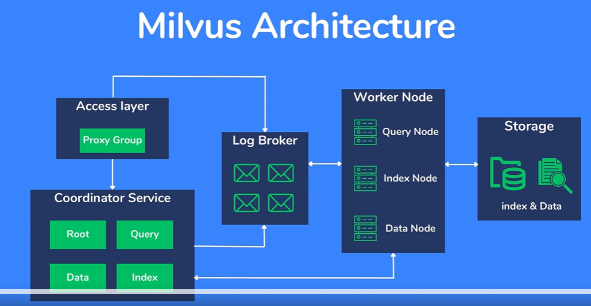
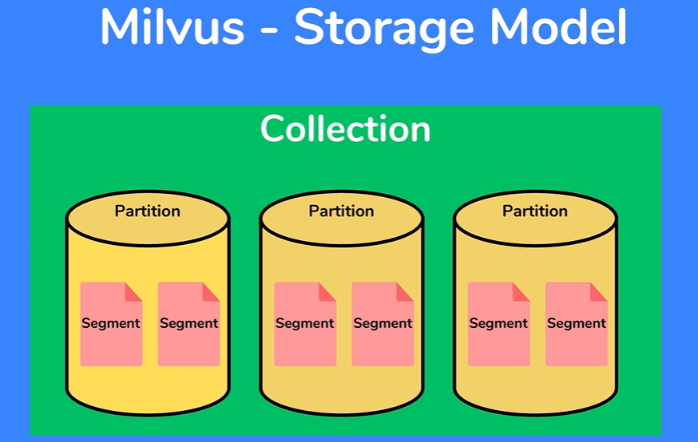

WHat is vector database
WHy we use vector database
What is the source of vector database

COmponent of vector database

Vector Embeddings
    semantic similarities
    
Architecture

5 Major Component
1. Access Layer
2. Log Broker
3. Coordinator Service
4. Worker Node
5. Storage

Storage
