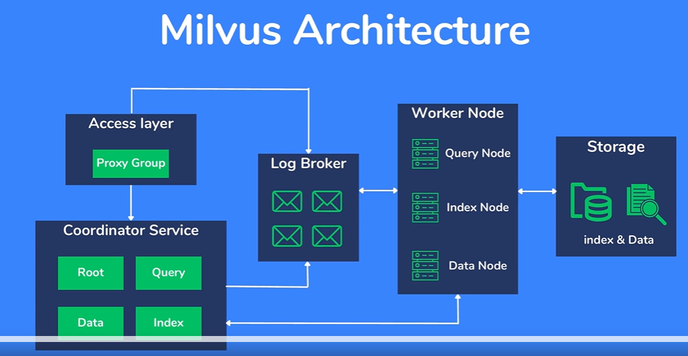

### Link 
- *https://milvus.io/docs/install_cluster-milvusoperator.md*
- *https://github.com/zilliztech/milvus-operator/blob/main/config/samples/cluster_demo.yaml*
- *https://github.com/milvus-io/milvus-operator/blob/v0.7.17/docs/CRD/milvus.md*

1. Install cert-manager
```sh
# install cert-manager
kubectl apply -f https://github.com/jetstack/cert-manager/releases/download/v1.5.3/cert-manager.yaml

# check if cert-manager pods
kubectl get pods -n cert-manager

NAME                                      READY   STATUS    RESTARTS   AGE
cert-manager-848f547974-gccz8             1/1     Running   0          70s
cert-manager-cainjector-54f4cc6b5-dpj84   1/1     Running   0          70s
cert-manager-webhook-7c9588c76-tqncn      1/1     Running   0          70s
```

2. Install Milvus Operator
```sh
# install Milvus Operator with Helm
helm install milvus-operator \
  -n milvus-operator --create-namespace \
  --wait --wait-for-jobs \
  https://github.com/zilliztech/milvus-operator/releases/download/v0.9.17/milvus-operator-0.9.17.tgz


#  Milvus Operator pod is running
kubectl get pods -n milvus-operator

NAME                               READY   STATUS    RESTARTS   AGE
milvus-operator-5fd77b87dc-msrk4   1/1     Running   0          46s
```

3. Deploy a Milvus cluster
```sh
# deploy a Milvus cluster
kubectl apply -f https://raw.githubusercontent.com/zilliztech/milvus-operator/main/config/samples/milvus_cluster_default.yaml


# Check Milvus cluster status
kubectl get milvus my-release -o yaml


# status of all pods in the Milvus cluster
kubectl get pods
```

4. Forward a local port to Milvus
```sh
# Run the following command to get the port at which your Milvus cluster serves
kubectl get pod milvus-demo-milvus-proxy-58668d5cbd-rn6dr --template
='{{(index (index .spec.containers 0).ports 0).containerPort}}{{"\n"}}'

# Forward a local port to the port at which Milvus serves
kubectl port-forward service/milvus-demo-milvus 12321:19530
```

5. Install Python SDK
- Install virtual environment for pyhton
```sh
pip install virtualenv
```
- Create virtual env in required folder
```sh
python -m venv milvus
```
- Start virtual env
```sh
milvus\Scripts\activate
``` 
- Install package
```sh
pip install pymilvus==2.4.0  jupyterlab protobuf==3.20.0
```
- start jupyterlab
```
jupyter-lab
```
- Test process
```py
from pymilvus import Collection, FieldSchema, CollectionSchema, DataType, connections, utility

connections.connect(
    host='localhost',
    # port frwrd to 12321
    port='12321'
)

utility.list_collections()

## Field Schema
song_name = FieldSchema(
  name="song_name",
  dtype=DataType.VARCHAR,
  max_length=200,
)
song_id = FieldSchema(
  name="song_id",
  dtype=DataType.INT64,
  is_primary=True,
)
listen_count = FieldSchema(
  name="listen_count",
  dtype=DataType.INT64,
)
song_vec = FieldSchema(
  name="song_vec",
  dtype=DataType.FLOAT_VECTOR,
  dim=64
)
song_json = FieldSchema(
  name="song_json",
  dtype=DataType.JSON
)
song_array = FieldSchema(
  name='song_array', dtype=DataType.ARRAY,
  element_type=DataType.INT64,
  max_capacity=900
)

# Collection schema
collection_schema = CollectionSchema(
  fields=[song_name, song_id, listen_count, song_vec, song_json, song_array],
  description="Album Songs"
)

# Create collection
collection = Collection(
    name="Album1",
    schema=collection_schema,
    using='default'
)

utility.list_collections()
```




